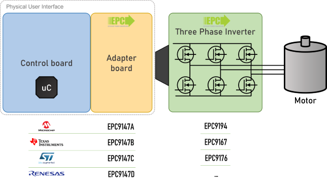

# EPC Reference Designs Firmware

Repository for EPC's application reference designs firmware.

Here you can find both the projects **source code** and the **compiled executables** (binaries) if you want to start right away.

## Motor Drive Setup

Motor Drive Section is intended for motor drive reference designs.\
Each reference design is composed of 4 pieces:

- Controller (MCU) board
- EPC adapter board
- EPC power board (inverter)
- Motor

**Setup example**:

- STM32 Nucleo G431RB +  EPC9147C + EPC9167HC + Teknic Motor M-3411P-LN-08D

> There are several combinations, follow the instruction on the [Cross-Reference Table](#cross-reference-table) or on the [Excel sheet ](/FindYourFirmwarePackage.xlsx) to download proper package.

### Teknic Motor

All *Reference Designs* firmware have been develop for the motor: ***Teknic M-3411P-LN-08D***

*Image: courtesy of Teknic, Inc.*

#### Useful Resources

- [Motor Website](https://teknic.com/hudson-model/M-3411P-LN-08D/)

### Cross-Reference Table

Use this table to find the firmware package that match you **inverter** and your **microcontroller**.

|      | .png) Microchip *MA330031-2 PIM*| .png) STM32 *Nucleo G431RB*| .png) Renesas *RA6T2*| .png) TI *LaunchXL-F28069M*|
|  ---:|:-:|:-:|:-:|:-:|
|**Adapter Board →**|**[EPC9147A][epc9147a]**|**[EPC9147C][epc9147c]**|**[EPC9147D][epc9147d]**|**[EPC9147B][epc9147b]**|
|[EPC9176][epc9176]|**[Executables][out_mchp_epc9176]** [Source Code][src_mchp_epc9176]|**[Executables][out_stm32_epc9176]** [Source Code][src_stm32_epc9176]|-|**[Executables][out_ti]** [Source Code][src_ti]|
|[EPC9193][epc9193]|**[Executables][out_mchp_epc9194]** [Source Code][src_mchp_epc9194]|**[Executables][out_stm32_epc9194]** [Source Code][src_stm32_epc9194]|-|-|
|[EPC9193HC][epc9193]|**[Executables][out_mchp_epc9194]** [Source Code][src_mchp_epc9194]|**[Executables][out_stm32_epc9194]** [Source Code][src_stm32_epc9194]|-|-|
|[EPC9194][epc9194]|**[Executables][out_mchp_epc9194]** [Source Code][src_mchp_epc9194]|**[Executables][out_stm32_epc9194]** [Source Code][src_stm32_epc9194]|**[Executables][out_renesas_epc9194]** [Source Code][src_renesas_epc9194]|-|
|[EPC9173][epc9173]|**[Executables][out_mchp_epc9194]** [Source Code][src_mchp_epc9194]|**[Executables][out_stm32_epc9194]** [Source Code][src_stm32_epc9194]|-|**[Executables][out_ti]** [Source Code][src_ti]|
|[EPC9186][epc9186]|-|**[Executables][out_stm32_epc9186]** [Source Code][src_stm32_epc9186]|-|-|
|[⚠️EPC9145][epc9145]|**[Executables][out_mchp_epc9145]** [Source Code][src_mchp_epc9145]|**[Executables][out_stm32_epc9145]** [Source Code][src_stm32_epc9145]|-|**[Executables][out_ti]** [Source Code][src_ti]|
|[⚠️EPC9146][epc9146]|**[Executables][out_mchp_epc9146]** [Source Code][src_mchp_epc9146]|**[Executables][out_stm32_epc9146]** [Source Code][src_stm32_epc9146]|-|**[Executables][out_ti]** [Source Code][src_ti]|
|[⚠️EPC9167][epc9167]|**[Executables][out_mchp_epc9145]** [Source Code][src_mchp_epc9145]|**[Executables][out_stm32_epc9145]** [Source Code][src_stm32_epc9145]|-|**[Executables][out_ti]** [Source Code][src_ti]|
|[⚠️EPC9167HC][epc9167]|**[Executables][out_mchp_epc9145]** [Source Code][src_mchp_epc9145]|**[Executables][out_stm32_epc9145]** [Source Code][src_stm32_epc9145]|-|**[Executables][out_ti]** [Source Code][src_ti]|

> :warning: **Warning:** obsolete board

> :memo: **Note:** missing packages for a specific reference design can be easily derived starting from a project for a different inverter but with the same microcontroller

<!-- ## Instructions

- Open the `FindYourFirmwarePackage.xlsx` file
- Use the filter combo box to select which .zip directory to download
- Download proper zip file
- Unzip the file in your hard disk preservign the directory structure
- Use specific vendor IDE tools to download executable to the flash and/or to compile the source code -->

<!-- --- CROSS-REF TABLE LINKS --- -->

<!-- Adapter Boards -->
[epc9147a]: https://epc-co.com/epc/products/evaluation-boards/epc9147a
[epc9147b]: https://epc-co.com/epc/products/evaluation-boards/epc9147b
[epc9147c]: https://epc-co.com/epc/products/evaluation-boards/epc9147c
[epc9147d]: https://epc-co.com/epc/products/evaluation-boards/epc9147d

<!-- Inverter Boards -->
[epc9176]: https://epc-co.com/epc/products/evaluation-boards/EPC9176
[epc9193]: https://epc-co.com/epc/products/demo-boards/EPC9193.aspx
[epc9194]: https://epc-co.com/epc/products/evaluation-boards/EPC9194
[epc9173]: https://epc-co.com/epc/products/evaluation-boards/EPC9173
[epc9186]: https://epc-co.com/epc/products/evaluation-boards/EPC9186
[epc9145]: https://epc-co.com/epc/products/evaluation-boards/EPC9145
[epc9146]: https://epc-co.com/epc/products/evaluation-boards/EPC9146
[epc9167]: https://epc-co.com/epc/products/evaluation-boards/EPC9167

<!-- Firmware Source & Packages -->
[out_stm32_epc9145]: https://github.com/epc-co/MotorDrive-RefDesign-Firmware/releases/download/pkg-rel-1.0/G431-EPC9145-DummyNema34_50k_100n_output.zip
[out_stm32_epc9146]: https://github.com/epc-co/MotorDrive-RefDesign-Firmware/releases/download/pkg-rel-1.0/G431-EPC9146_2_1-DummyNema34_50k_100n_output.zip
[out_stm32_epc9176]: https://github.com/epc-co/MotorDrive-RefDesign-Firmware/releases/download/pkg-rel-1.0/G431-EPC9176_1_0-DummyNema34_50k_100n_output.zip
[out_stm32_epc9186]: https://github.com/epc-co/MotorDrive-RefDesign-Firmware/releases/download/pkg-rel-1.0/G431-EPC9186-DummyNema34_50k_100n_output.zip
[out_stm32_epc9194]: https://github.com/epc-co/MotorDrive-RefDesign-Firmware/releases/download/pkg-rel-1.0/G431-EPC9194-DummyNema34_50k_100n_output.zip
[src_stm32_epc9145]: /firmware/G431-EPC9145-DummyNema34_50k_100n/G431-EPC9145-DummyNema34_50k_100n.zip
[src_stm32_epc9146]: /firmware/G431-EPC9146_2_1-DummyNema34_50k_100n/G431-EPC9146_2_1-DummyNema34_50k_100n.zip
[src_stm32_epc9176]: /firmware/G431-EPC9176_1_0-DummyNema34_50k_100n/G431-EPC9176_1_0-DummyNema34_50k_100n.zip
[src_stm32_epc9186]: /firmware/G431-EPC9186-DummyNema34_50k_100n/G431-EPC9186_1_0-DummyNema34_50k_100n.zip
[src_stm32_epc9194]: /firmware/G431-EPC9194-DummyNema34_50k_100n/G431-EPC9194-DummyNema34_50k_100n.zip

[out_ti]: https://github.com/epc-co/MotorDrive-RefDesign-Firmware/releases/download/pkg-rel-1.0/InstaSPIN_F2806xM_UNIVERSAL_output.zip
[src_ti]: /firmware/InstaSPIN_F2806xM_UNIVERSAL/InstaSPIN_F2806xM_UNIVERSAL.zip

[out_renesas_epc9194]: https://github.com/epc-co/MotorDrive-RefDesign-Firmware/releases/download/pkg-rel-1.0/RA6T2-EPC9194-DummyNema34-20k-2000n_output.zip
[src_renesas_epc9194]: /firmware/RA6T2-EPC9194-DummyNema34-20k-2000n/r01an6206xx0101-motor.zip

[out_mchp_epc9146]: https://github.com/epc-co/MotorDrive-RefDesign-Firmware/releases/download/pkg-rel-1.0/sample-mb-33ep-epc9146_2_0_DummyNema34_14A_3_5A_1_5mohm_1_3krpm_100kHz_21ns_210412_output.zip
[out_mchp_epc9145]: https://github.com/epc-co/MotorDrive-RefDesign-Firmware/releases/download/pkg-rel-1.0/sample-mb-33ep256mc506-mclv2.X-Dummy_9145_14A_3A_1_0mohm_1_3krpm_100kHz_50ns_210806_output.zip
[out_mchp_epc9176]: https://github.com/epc-co/MotorDrive-RefDesign-Firmware/releases/download/pkg-rel-1.0/sample-mb-33ep256mc506-mclv2.X-Dummy_9176_14A_3A_1_0mohm_1_3krpm_100kHz_50ns_230125_output.zip
[out_mchp_epc9194]: https://github.com/epc-co/MotorDrive-RefDesign-Firmware/releases/download/pkg-rel-1.0/sample-mb-33ep256mc506-mclv2.X-Dummy_9194_14A_3A_1_0mohm_1_3krpm_100kHz_50ns_240625_output.zip
[src_mchp_epc9146]: /firmware/sample-mb-33ep-epc9146_2_0_DummyNema34_14A_3_5A_1_5mohm_1_3krpm_100kHz_21ns_210412/sample-mb-33ep-epc9146_2_0_DummyNema34_14A_3_5A_1_5mohm_1_3krpm_100kHz_21ns_210412.zip
[src_mchp_epc9145]: /firmware/sample-mb-33ep256mc506-mclv2.X-Dummy_9145_14A_3A_1_0mohm_1_3krpm_100kHz_50ns_210806/sample-mb-33ep256mc506-mclv2.X-Dummy_9145_14A_3A_1_0mohm_1_3krpm_100kHz_50ns_210806.zip
[src_mchp_epc9176]: /firmware/sample-mb-33ep256mc506-mclv2.X-Dummy_9176_14A_3A_1_0mohm_1_3krpm_100kHz_50ns_230125/sample-mb-33ep256mc506-mclv2.X-Dummy_9176_14A_3A_1_0mohm_1_3krpm_100kHz_50ns_230125.zip
[src_mchp_epc9194]: /firmware/sample-mb-33ep256mc506-mclv2.X-Dummy_9194_14A_3A_1_0mohm_1_3krpm_100kHz_50ns_240625/sample-mb-33ep256mc506-mclv2.X-Dummy_9194_14A_3A_1_0mohm_1_3krpm_100kHz_50ns_240625.zip
